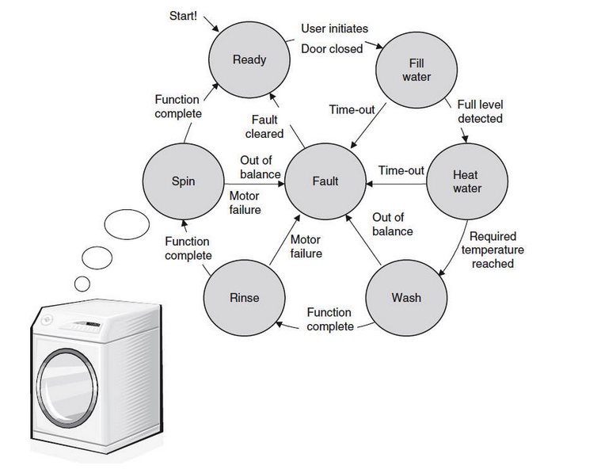

# Washing Machine Controller
✨🐾✨ This project aims to design a Control System for Washing Machine using Verilog HDL.

* The washing machine controller has the following functionalities:
The washing machine has the following states: start, ready, fill water, heat water, wash, rinse, spin and fault.

* Different time durations are allocated to each mode of operation.

* Resume washing cycle from the state when:

	🚫  the operation is timed out.
	
    🚫  the operation is out of balance.

	🚫  motor fails.

## System Design
The microcontroller is composed of two blocks:

🔹📍A finite state machine block (controller)

🔹📍 A timer block.

---
### ⚪️ Controller
The FSM (controller) block receives some signals from the user, from the timer, and other hardware parts such as the door sensor. FSM block output controls the timer block and other hardware components of the washing machine. The FSM has the following states:

* START
* READY
* FILL WATER
* HEAT WATER
* WASH
* RINSE
* SPIN
* FAULT

State transitions take place according to the timing control signals generated by the timer block and inputs given to a particular state. The processing in the next state depends on outputs produced in the previous state.

### ⚪️ Timer

The timer block generates the correct time periods required for each cycle after it has been reset. The timer block gives the correct time signals once certain count values have been achieved.

Once the washing process starts, the state transitions take place according to the control signals generated by the Timer unit.

----
## How it works 
* Once the coin is inserted, the FSM will go to the READY state. If in READY state the process is canceled, the coin is returned as the washing process has not yet started and the FSM returns to the START state. But once the washing process starts, cancellation results in loss of the coin.

* The FSM has been designed to handle accidents such as motor failure in the middle of a cycle. The machine goes to  READY stage in such situations.

* The control signal to activate the water intake is generated during both the FILL WATER and RINSE states, as both the operations require a fresh intake of water.

* In the last state, SPIN is completed, the FSM transits back to START state to take orders for the new wash cycle.

## Dependencies

### macOS
This project needs [Icarus-Verilog](http://iverilog.icarus.com) and a VCD viewer.

## Building on macOS
1. Icarus-Verilog can be installed via Homebrew :
   <code>$ brew install icarus-verilog</code>
2. Download [Scansion](http://www.logicpoet.com/scansion/) from here.  
3. Clone the repository.
4. Change the directory to src.
5. <code>$ make check</code>- compiles the verilog design - good for checking code.
6. <code>$ make simulate</code> - compiles design+TB & simulates the verilog design.
7. <code>$ make display</code> - displays waveforms.

### Washing cycle stages

